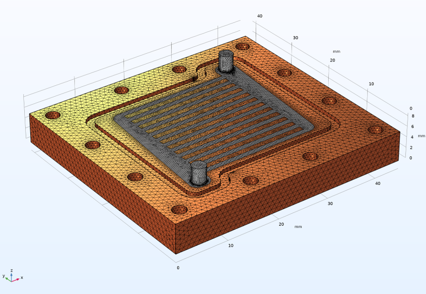
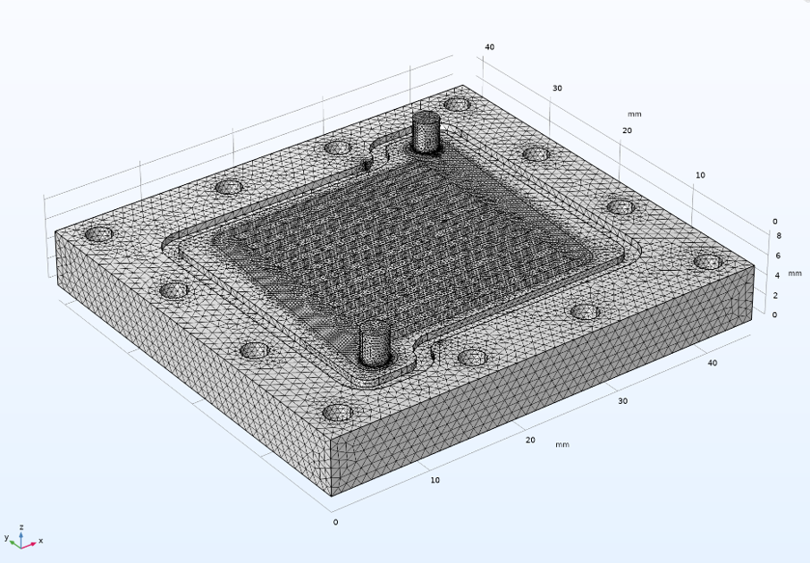
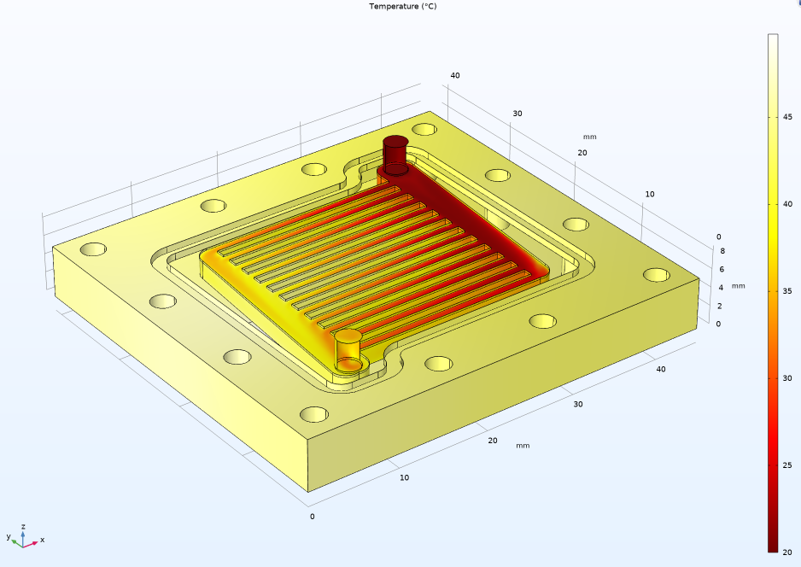
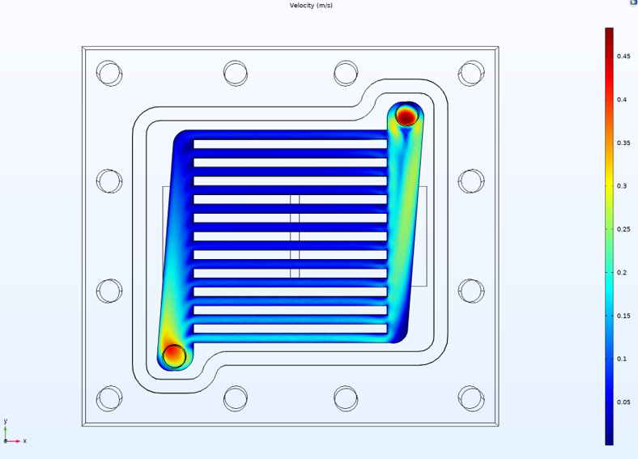
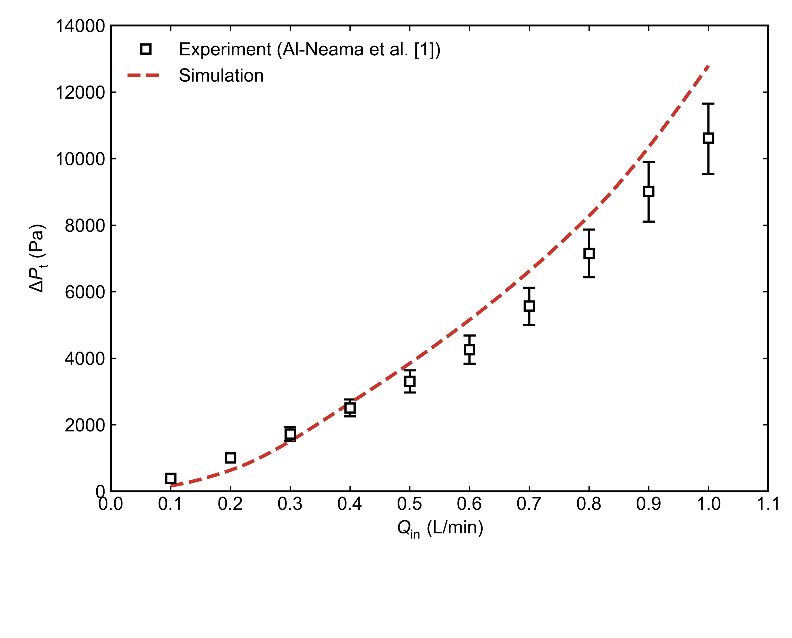

# Thermal-Hydraulic Simulation of a Microchannel Heat Sink

**COMSOL Multiphysics | 3D Conjugate Heat Transfer | Single-Phase Water Cooling**

## Overview

This project reproduces the **straight rectangular microchannel (SRM) heat sink**
configuration reported by Al-Neama et al. [1].

A three-dimensional steady-state conjugate heat transfer model was developed
in COMSOL Multiphysics to simulate single-phase water flow and heat transfer
through parallel rectangular microchannels embedded in a copper heat sink.

The project focuses on:

- 3D conjugate heat transfer modelling of the SRM heat sink
- Flow and temperature distributions within the cooling system
- Pressure-drop prediction over a range of coolant flow rates
- Validation of simulated pressure drop against published experimental data

Only the SRM configuration from the original study is reproduced in this project.

---

## Model Setup

The computational geometry was reconstructed based on the SRM configuration
reported in the reference study. The model consists of a copper heat sink
containing 12 parallel straight rectangular microchannels.

Single-phase water enters the inlet manifold, is distributed through the
parallel channels, and exits through the outlet manifold.

*Figure 1. Computational geometry of the straight rectangular microchannel heat sink.*

### Geometry

| Parameter | Value |
|---|---:|
| Heat sink dimensions | 45 × 41 × 5.5 mm |
| Number of microchannels | 12 |
| Channel width | 1 mm |
| Channel depth | 2 mm |
| Channel length | 21 mm |
| Wall thickness | 1 mm |
| Base thickness | 3.5 mm |

### Numerical Model

| Parameter | Setting |
|---|---|
| Software | COMSOL Multiphysics |
| Solid material | Copper |
| Coolant | Liquid water |
| Heat transfer model | Heat Transfer in Solids and Fluids |
| Flow model | Turbulent flow, k-ω |
| Analysis | 3D steady-state |
| Coolant flow rate | 0.1–1.0 L/min |
| Inlet temperature | 293.15 K (20 °C) |
| Outlet pressure | 0 Pa gauge |
| Applied heat flux | 3.5 × 10⁵ W/m² |
| Thermal interface thickness | 0.2 mm |
| Thermal interface resistance | 9.09 × 10⁻⁵ m²·K/W |

### Boundary Conditions

Water was introduced through the inlet using a prescribed mass flow rate,
with the flow rate varied to reproduce the investigated operating conditions.
The inlet water temperature was fixed at **293.15 K**, while the outlet was
specified at **0 Pa gauge pressure**.

A uniform heat flux of **3.5 × 10⁵ W/m²** was applied to the heated surfaces.
A **0.2 mm thin thermal-resistance layer** was included between the heat source
and the copper heat sink. The remaining external surfaces were treated as
thermally insulated where applicable.

---

## Mesh Strategy

The computational domain was discretized primarily using an unstructured
tetrahedral mesh. Local mesh refinement was applied in the microchannel region
and near the fluid-solid interfaces, where relatively large velocity and
temperature gradients were expected.

Boundary-layer elements were introduced along the channel walls to improve
near-wall resolution.

The final mesh contained approximately **438,000 tetrahedral elements**.

*Figure 2. Computational mesh of the SRM heat sink model with local refinement
in the microchannel region.*

---

## Results

### Temperature Distribution

*Figure 3. Predicted temperature distribution in the SRM heat sink.*

The predicted temperature field shows the combined effects of heat conduction
through the copper block and convective cooling within the microchannels.
Local temperature non-uniformity remains across the heated region, indicating
that thermal performance depends not only on coolant flow rate but also on
flow distribution and the conduction path between the heat source and channels.

### Flow Field

*Figure 4. Coolant velocity distribution through the SRM flow domain.*

The velocity field shows non-uniform flow distribution among the parallel
microchannels, with higher velocities observed in channels farther from the
inlet. This flow maldistribution results from the pressure distribution within
the inlet manifold and highlights the influence of manifold design on coolant
distribution and cooling uniformity.

### Pressure Drop Validation

The total pressure drop across the heat sink was evaluated from the pressure
difference between the inlet and outlet sections for different coolant flow
rates.

*Figure 5. Comparison of simulated pressure drop with experimental data
reported by Al-Neama et al. [1].*

The simulated pressure drop increases nonlinearly with coolant flow rate and
captures the overall trend observed in the experimental measurements.

Agreement is closer at intermediate flow rates, while the deviation increases
at higher flow rates. The remaining discrepancies are likely associated with
mesh resolution and minor geometric differences between the reconstructed
model and the original experimental configuration.

---

## Engineering Takeaways

- The reconstructed 3D model captures the nonlinear increase in pressure drop
  with increasing coolant flow rate observed experimentally.
- Parallel microchannels provide distributed coolant flow and a large
  fluid-solid heat-transfer area within a compact heat sink.
- Increasing coolant flow rate enhances convective heat removal while also
  increasing the hydraulic pressure-drop penalty.
- Local mesh refinement and near-wall resolution are important for resolving
  the flow and thermal fields within small channels.
- This project demonstrates a complete simulation workflow including geometry
  reconstruction, conjugate heat transfer modelling, turbulence modelling,
  mesh refinement, parametric simulation, post-processing, and validation
  against experimental pressure-drop data.

---

## Limitations

This project focuses on reproducing the **SRM baseline configuration** from the
original study rather than all four microchannel heat sink designs.

Due to available computational resources, a comprehensive mesh-independence
study was not performed. The current mesh therefore represents a compromise
between spatial resolution and computational cost.

---

## Reference

[1] A. F. Al-Neama, N. Kapur, J. Summers, and H. M. Thompson,
“An experimental and numerical investigation of the use of liquid flow in
serpentine microchannels for microelectronics cooling,”
*Applied Thermal Engineering*, vol. 116, pp. 709–723, 2017.
